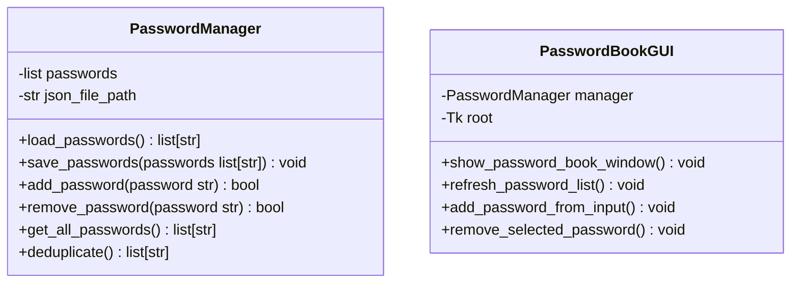
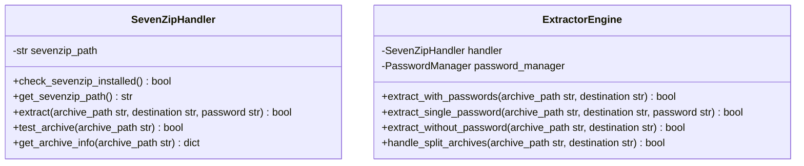
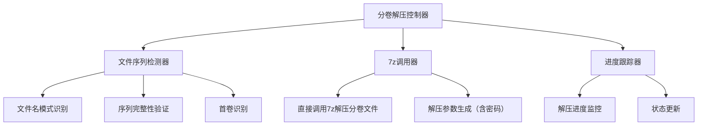
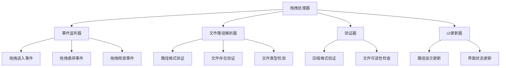

# 解压软件系统架构设计文档

## 1. 项目概述

本项目是一个基于Python的PC端解压软件，通过调用本地7z软件来解压常见的压缩文件格式。该软件旨在提供比Python内置解压库更高的解压效率，同时具备密码本管理和分卷解压功能。

## 2. 功能需求

### 2.1 核心功能
- 解压常见压缩格式（RAR、ZIP、7Z）,也支持常用的分卷压缩模式(7z.001)等
- 集成密码本功能，支持添加/删除密码及去重
- 调用本地7z进行解压操作
- 提供图形用户界面
- 支持拖拽识别压缩文件路径
- 支持分卷解压
- 支持无密码解压（针对非加密压缩文件）

### 2.2 技术选型
- GUI框架：Tkinter
- 压缩格式支持：通过7z命令行
- 密码本存储：JSON文件
- 拖拽功能：tkinterdnd2库

## 3. 系统架构

```
解压软件
├── 主程序入口 (main.py)
├── 图形用户界面 (gui/)
│   ├── 主窗口 (MainWindow)
│   ├── 文件选择对话框
│   └── 密码本管理界面
├── 核心功能模块 (core/)
│   ├── 解压引擎 (extractor.py)
│   ├── 密码本管理器 (password_manager.py)
│   └── 7z调用器 (sevenzip_handler.py)
├── 工具类 (utils/)
│   ├── 文件操作工具 (file_utils.py)
│   └── 配置管理器 (config.py)
└── 数据存储 (data/)
    └── passwords.json
```

## 4. 模块详细设计

### 4.1 主程序入口 (main.py)
- 启动应用程序
- 初始化GUI界面
- 创建必要的目录结构

### 4.2 图形用户界面模块 (gui/)

#### 4.2.1 主窗口 (MainWindow)
- 文件路径输入框：显示压缩文件路径
- 浏览按钮：打开文件选择对话框
- 密码输入框：手动输入解压密码（可选，主要用于管理密码本）
- 显示/隐藏密码复选框：控制密码可见性
- 解压按钮：启动解压过程
- 停止按钮：终止当前解压进程
- 进度条：显示解压进度
- 状态标签：显示当前操作状态
- 密码本管理按钮：打开密码管理窗口
- 拖拽区域：可视化拖拽提示区域

#### 4.2.2 拖拽处理逻辑
- 用户拖拽文件后，系统自动检测文件类型并填充路径
- 界面自动开始解压流程，无需用户干预
- 不向用户请求密码，仅使用密码本中的密码进行尝试

### 4.3 核心功能模块 (core/)

#### 4.3.1 密码本管理器 (password_manager.py)



- **数据模型**: JSON文件存储
```json
{
  "passwords": [
    "password1",
    "password2",
    "password3"
  ],
  "last_updated": "2023-12-01T10:00:00Z"
}
```

- **核心方法**:
  - `load_passwords()`: 从JSON文件加载密码列表
  - `save_passwords(passwords)`: 将密码列表保存到JSON文件
  - `add_password(password)`: 添加新密码，自动去重
  - `remove_password(password)`: 删除指定密码
  - `deduplicate(passwords)`: 移除重复密码
  - `get_all_passwords()`: 获取所有密码列表

#### 4.3.2 7z调用器 (sevenzip_handler.py)



- **命令行接口**:
  - 基本解压（无密码）: `7z x -y -o"destination" archive.7z`
  - 带密码解压: `7z x -y -p"password" -o"destination" archive.7z`
  - 静默模式解压: `7z x -y -bd -p"password" -o"destination" archive.7z`

- **参数说明**:
  - `x`: 解压并保留完整路径结构
  - `-y`: 对所有查询回答 "是"（自动覆盖）
  - `-o{directory}`: 指定输出目录
  - `-p{password}`: 指定密码（无密码时不使用此参数）
  - `-bd`: 禁止显示进度条（静默模式）

#### 4.3.3 解压引擎 (extractor.py)
- **extract_with_passwords(archive_path, destination)**: 使用密码本中的密码尝试解压
- **extract_single_password(archive_path, destination, password)**: 使用单个密码解压
- **extract_without_password(archive_path, destination)**: 无密码解压（默认首次尝试）
- **handle_split_archives(archive_path, destination)**: 处理分卷压缩包（直接调用7z，无需拼接）

### 4.4 工具类 (utils/)

#### 4.4.1 文件操作工具 (file_utils.py)
- 文件类型检测
- 路径验证
- 分卷文件识别
- 加密状态检测（如果可能）
- 分卷文件序列检测
- 完整分卷序列验证

#### 4.4.2 配置管理器 (config.py)
- 应用配置管理
- 7z路径配置

## 5. 功能流程设计

### 5.1 解压流程
```
用户拖拽或选择文件 → 系统自动检测文件类型 → 首先尝试无密码解压 → 
如失败则使用密码本中的每个密码依次尝试 → 如果所有密码都失败，返回解压失败 → 显示结果
```

### 5.2 拖拽处理流程（重点）
- 用户拖拽文件到界面
- 系统自动识别文件类型并填充路径
- 界面自动开始解压流程
- 首先尝试无密码解压
- 如失败，遍历密码本中的所有密码逐一尝试
- 如果密码本中所有密码都失败，直接返回解压失败
- 不向用户请求新的密码

### 5.3 无密码解压处理
- 当开始解压时，系统首先尝试无密码解压
- 无密码解压不会报错，而是作为默认的首次解压尝试
- 针对非加密压缩文件，无密码解压是正常操作

### 5.4 密码本解压处理
- 如果无密码解压失败，系统会获取密码本中的所有密码
- 按顺序使用密码本中的每个密码尝试解压
- 如果任何一个密码成功，解压完成
- 如果所有密码都失败，返回解压失败

### 5.5 密码本管理流程
```
读取JSON → 去重处理 → 添加/删除密码 → 保存JSON
```

### 5.6 分卷解压流程（优化后）



- **解压流程**:
```
用户选择任一分卷文件 → 检测分卷序列 → 验证完整性 →
识别首卷文件 → 直接调用7z解压（7z自动处理分卷）→
监控解压进度 → 完成分卷解压
```

### 5.7 拖拽功能流程



- **拖拽后处理**:
```
检测到文件拖拽 → 验证文件有效性 → 填充文件路径 → 
自动开始解压（无密码优先→密码本遍历）
```

## 6. 核心算法设计

### 6.1 分卷文件识别模式
- **RAR格式**: part1.rar, part2.rar, ... 或 archive.part1.rar, archive.part2.rar, ... 或 archive.r00, archive.r01, ...
- **ZIP格式**: archive.zip, archive.z01, archive.z02, ...
- **7Z格式**: archive.7z.001, archive.7z.002, ... 或 archive.001, archive.002, ...

### 6.2 分卷文件处理算法
- **检测分卷序列**: 识别所有相关的分卷文件
- **验证完整性**: 确保所有分卷文件都存在且按正确顺序
- **首卷识别**: 确定分卷序列的第一个文件
- **直接调用7z**: 使用7z命令行工具直接解压首卷文件（7z自动处理所有分卷）

### 6.3 密码本去重算法
- 使用集合(set)进行高效去重
- 保持原始顺序（使用有序字典或列表推导）

### 6.4 自动解压判断逻辑
- 用户拖拽文件后，界面自动开始解压流程
- 首先尝试无密码解压
- 如果失败，遍历密码本中的所有密码进行尝试
- 如果所有密码都失败，直接返回解压失败，不向用户请求新密码

## 7. 错误处理机制

### 7.1 无密码解压处理
- 空密码输入被视为默认操作（用于非加密文件）
- 不会对无密码解压尝试抛出错误
- 仅作为解压的第一步尝试

### 7.2 密码本解压处理
- 遍历密码本中的所有密码进行解压尝试
- 如果所有密码都失败，返回解压失败状态
- 不向用户请求新的密码

### 7.3 7z集成错误处理
- 7z未安装检测
- 无效路径验证
- 密码错误处理（继续尝试下一个密码）
- 磁盘空间不足检测

### 7.4 分卷解压错误处理
- 缺失分卷检测与报告
- 损坏分卷识别
- 序列混乱处理
- 权限问题处理
- 7z无法识别分卷格式处理

### 7.5 拖拽功能错误处理
- 拖拽过程异常处理
- 无效文件路径处理
- 权限不足处理

## 8. 安全考虑

### 8.1 数据安全
- 密码文件访问权限限制
- 防止明文密码泄露
- 定期备份密码本

### 8.2 系统安全
- 防止命令注入攻击
- 密码不显示在命令行历史中
- 临时文件安全清理
- 防止路径遍历攻击

## 9. 用户体验设计

### 9.1 界面设计原则
- 简洁直观的布局
- 符合Windows风格的设计
- 清晰的状态反馈

### 9.2 交互设计
- 拖拽功能的视觉反馈
- 解压进度显示
- 解压失败时的明确提示
- 不打扰用户的自动化解压流程
- 分卷解压时的额外进度指示

## 10. 性能优化

### 10.1 解压性能
- 利用7z的高性能解压能力
- 预先计算分卷总大小以便进度显示
- 优化文件扫描算法减少检测时间

### 10.2 内存管理
- 合理分配内存处理大容量分卷
- 避免不必要的内存占用
- 利用7z内置的分卷处理能力，无需额外内存开销

### 10.3 临时文件优化
- 使用系统临时目录
- 及时清理临时文件
- 监控磁盘空间使用

## 11. 扩展性考虑

### 11.1 模块化设计
- 各模块职责清晰分离
- 易于功能扩展和维护

### 11.2 格式扩展
- 便于添加新的压缩格式支持
- 通过7z支持更多格式